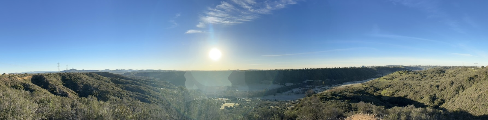

## Hi, I'm Derek 👋

Welcome to my GitHub profile! I'm currently a **Data & AI Analyst** at **The Wonderful Company**, navigating how we can **leverage AI** and **optimize workflows**. With a B.S. in **Math-Computer Science** from **UC San Diego**, I specialize in bridging complex mathematical logic with modern **software engineering**, focusing on **interactive visualizations**, **AI-driven insights**, and **performance tracking**.

---

### 🚀 Featured Projects

#### 🔥 [Aura: AI Workout Tracker](https://github.com/dklopstein/workout-tracker)
Modern fitness tracking with a focus on recovery visualization.
- **Tech:** React, TypeScript, Vite, Tailwind CSS, Supabase, Google Gemini API
- **Key Feature:** Uses LLMs to parse natural language workout logs and renders a dynamic 2D muscle heatmap to track recovery states.

#### 📊 [Weather Dashboard](https://github.com/dklopstein/weather-dashboard-etl)
A robust data pipeline for weather insights.
- **Tech:** AWS, Google Cloud, Python, ETL patterns, data visualization

#### 🧬 [Glucose Spike Analysis](https://github.com/dklopstein/glucose-spike-analysis)
Analytical tool for metabolic health tracking.
- **Tech:** JavaScript, D3, Data Analysis

---

### 🛠️ Tech Stack

| &nbsp; | Technologies |
| :--- | :--- |
| **Languages** |       |
| **Frontend/Web** |       |
| **Data & AI** |     |
| **Enterprise & DB** |      |
| **Tools & Backend** |     |

---

### 🎾 Beyond the Code
When I'm not building data pipelines or visualization tools, you'll find me:
- On the court playing **Tennis**, **Volleyball**, **Basketball**, or **Pickleball**.
- Exploring new ways to apply **Sports Analytics** to athletic performance.
- Deep-diving into the latest in **Autonomous AI Agents**.

---

### 📫 Connect with Me
- **LinkedIn:** [in/derek-klopstein](https://www.linkedin.com/in/derek-klopstein/)
- **Email:** [dvklopstein@gmail.com](mailto:dvklopstein@gmail.com)
