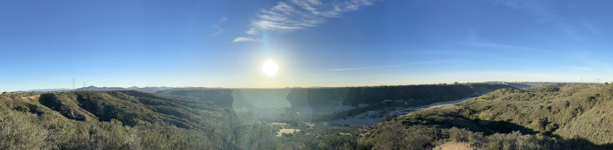

## About Me 👋

Hi, I'm Derek! I recently graduated with a Bachelor of Science in Math-Computer Science and a minor in Data Science from the University of California, San Diego.

I'm interested in sports and data analytics, as well as learning new things. I love playing sports too — my favorites are tennis, volleyball, basketball, and pickle ball currently.

Don't forget to check out my projects below!

Reach me by email: dvklopstein@gmail.com

<!-- 
Using:
https://github.com/alexandresanlim/Badges4-README.md-Profile?tab=readme-ov-file#-languages- 
-->

### Languages

### Frameworks and Libraries

 